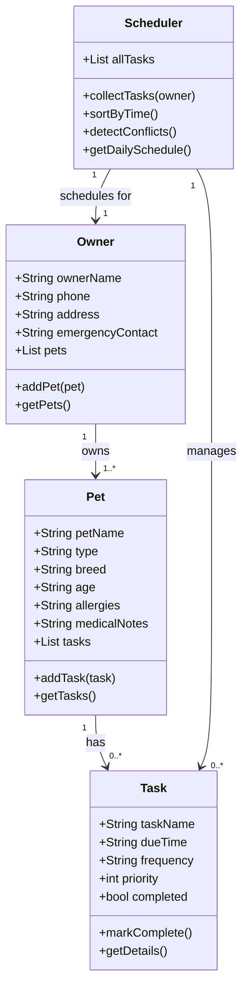

```mermaid
classDiagram
    class Owner {
        +String ownerName
        +String phone
        +String address
        +String emergencyContact
        +List pets
        +addPet(pet)
        +getPets()
    }

    class Pet {
        +String petName
        +String type
        +String breed
        +String age
        +String allergies
        +String medicalNotes
        +List tasks
        +addTask(task)
        +getTasks()
    }

    class Task {
        +String taskName
        +String dueTime
        +String frequency
        +int priority
        +bool completed
        +markComplete()
        +getDetails()
    }

    class Scheduler {
        +List allTasks
        +collectTasks(owner)
        +sortByTime()
        +detectConflicts()
        +getDailySchedule()
    }

    Owner "1" --> "1..*" Pet : owns
    Pet "1" --> "0..*" Task : has
    Scheduler "1" --> "1" Owner : schedules for
    Scheduler "1" --> "0..*" Task : manages
```
